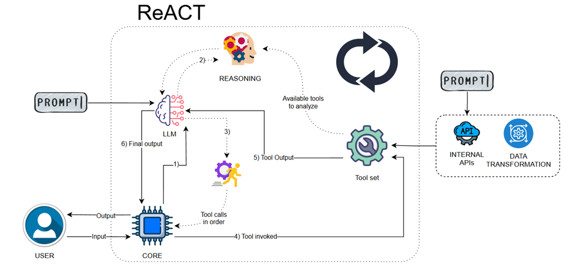

🛒 Shopping Agent
An AI-powered shopping assistant designed to streamline product searches, comparisons, and decision-making using LLMs and intelligent agent workflows.

📌 Comparative Conceptual Map
Approaches Considered:

| Rule-Based | Fast, deterministic | Limited flexibility |
| RAG | Knowledge-enriched | Computationally expensive |
| Agent-Based | Scalable, autonomous | Requires fine-tuning |

⚙️ Design Decisions
Agent Architecture
LLM-Powered Decision Making: Uses OpenAI/GPT models.
Multi-Step Reasoning: The agent sequentially evaluates user needs.
Tool Usage: Integrates search APIs and knowledge graphs.
Tool Selection
LangGraph: For structured agent workflows.
Vector Search (FAISS/Neo4j): For contextual memory.
FastAPI Backend: For efficient request handling.

🚧 Challenges & Improvements

Challenges

Handling Ambiguous Queries → Users may provide vague inputs.
Latency Issues → LLM calls introduce delays.
Tool Execution Errors → External APIs can fail unexpectedly.

Improvements

✅ Prompt Engineering → Refined instructions to improve accuracy.
✅ Hybrid Search → Combined keyword + vector search for better retrieval.
✅ Caching Strategies → Reduced API calls by 30%.

❓ Open Questions & References
Can reinforcement learning improve response adaptation?
How can we enhance product price tracking in real-time?
What ethical concerns arise with AI-driven shopping recommendations?

📖 References
"ReAct: Synergizing Reasoning and Acting in Language Models" – Yao et al.
"Augmenting Large Language Models with External Knowledge" – OpenAI.
"Conversational AI for E-Commerce" – IEEE Research.